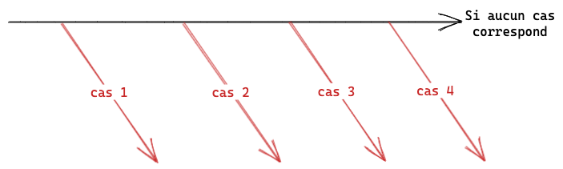

Les functions en programmation c'est la meilleur invention. Elle te permette de mieux séparer ton code, augmenter la lisibilité et surtout de réutiliser du code.

Dans ce module, on va voir comment créer une function, comment l'appeler et comment lui passer des paramètres.

Et dans cette exercice on va justement passé en revues toutes ces syntaxes en reprenant notre calculatrice, car le code est pour l'instant... vraiment pas beau.

Je te préviens, dans ce module on va voir beaucoup de concept JavaScript "avancée" vis-à-vis des functions.

Mais ce que j'aime... c'est qu'on vas continuer notre calculette en CLI ce qui va nous permettre de voir l'évolution de notre code.

Ce module va être intéressant... voir même épique !

On va voir beaucoup de concept compliqué, dans les vidéos solutions je prendrais le temps de tout t'expliquer et on se retrouvera dans le théoris de ce module pour revoir tout ça ensemble.

## Part 1 : Validation des numbers

Dans cette première parties on va venir déplacer la logique de validation des nombres dans une function.

Rappel toi, on faisait le code suivant pour `firstNumber` ET `secondNumber` :

```js
if (Number.isNaN(firstNumber) || Math.abs(firstNumber) > 100000000000000) {
  console.log(
    'Error : firstNumber is not a number or is too big / too small (max: 100000000000000)'
  );
  process.exit(1);
}
```

Ce serait pratique d'avoir une function qui gère **les deux cas** juste en faisant :

```js
validateNumber(firstNumber);
```

Justement, ce sera le sujet de ce module. On va créer la function `validateNumber` et déplacer la logique de notre code dedans.

Pour déclarer une function, tu utiliseras, pour commencer, la syntaxe suivante :

```js
function validateNumber(number) {
  // Code
}
```

- Le mot clé `function` permet de déclarer une function.
- Le nom (`validateNumber`) est le nom de la function. Ce qu'on va utiliser pour l'appeler.
- Le paramètre (`number`) est le nom de la variable qui va contenir la valeur qu'on va passer à la function.

```js
validateNumber(firstNumber);
//   │           │
//   └──────┐    └────────┐
//          │             │
function validateNumber(number) {
  // Code
}
```

Les émojis sont là pour t'aider.

## Part 2

Dans cette parties on va déplacer la logique conçernant le `prompt` qui vient récupérer les valeurs de l'input et le transformer en nombre.

On va créer une function `promptNumber` qui va nous permettre de récupérer un nombre depuis l'input.

Cette function va en plus appelé `validateNumber` pour directement validé tous les numbers qu'on capture depuis l'input.

Cette function aura les propriétés suivantes :

- nom : `promptNumber`
- paramètre : `message`
- return : `number` (le nombre récupéré depuis l'input)

Le `return` est un sujet super intéressant dont on parlera longtemps

```js
function promptNumber(message) {

  const number = /* ... */

  return number;
}//        │
//     ┌───┘
//     │
const value = promptNumber('Enter a number');
```

Quand on utilise le mot clé `return` ça permet de retourner une valeur depuis la function.

C'est à dire que la valeur va "quitté" la function pour être "envoyé" à l'endroit où on a appelé la function.

Par exemple le code suivant :

```js
const getPi = () => {
  return 3.14;
};

const pi = getPi();
console.log(pi); // 3.14
```

Le `return` à la spécificité **d'arrêter la lecture** de la function. On le verra dans les prochaines parties.

Pour résumer, ta mission est de créer une function `promptNumber` qui va récupérer un nombre depuis l'input et le retourner et remplacer chaque fois qu'on utilise `prompt` par `promptNumber` ainsi que supprimer la logique de validation des nombres car elle sera géré par `promptNumber`.

## Partie 3

Dans cette parties on va modifier la manière dont on affiche le résultat. Avant on utilisant un switch qui gérait les différents cas.

On va remplacer ça par une function et utiliser la puissance du mot clé `return` pour arrêter la lecture de la function chaque fois qu'on a trouvé le bon cas.

Ce return va nous permettre aussi de pouvoir facilement gérer le cas où on essaie de diviser par 0 si l'opération est une division.

Ta tâche sera de créer une function qui a cette signature :

```js
function calculateResult(operator, firstNumber, secondNumber) {...}
```

Elle prend en paramètre :

- `operator` : l'opérateur de l'opération
- `firstNumber` : le premier nombre
- `secondNumber` : le deuxième nombre

Et ensuite, tu vas utiliser des **if** pour chaque cas et utiliser le mot clé `return` pour arrêter la lecture de la function.



Quand tu fais return, tu **arrête instantanément** la lecture de la function et tu retourne la valeur.

Donc tout le code après n'est pas exécuté !

C'est pour ça qu'on va pouvoir vérifier chaque opérateur et dans le cas où on trouve le bon, on va faire un `return` de la valeur, ce qui va arrêter la lecture de la function et retourner la valeur.

Le `return` est un concept à lui tout seul et on va en parler dans le théorie de ce module.

Ta mission est de créer cette function et de supprimer la logique de `switch` qu'on avait avant.

## Partie 4 - Bonus

Bonus car on va abordé un sujet compliqué, la récursivité.

Dans l'exercice sur les conditions, parties 5 bonus on avait utilisé une boucle `while` pour récupérer l'opérateur jusqu'à ce qu'il soit valide.

Ici on va refaire la même feature mais avec une function récursive.

Pour ça on va créer une function `promptOperator` qui va récupérer l'opérateur depuis l'input et le retourner.

MAIS, si l'opérateur n'est pas valide (pas 1, 2, 3 ou 4) on va appeler la function `promptOperator` depuis la function `promptOperator`.

C'est à dire que notre function va s'appeler elle même.

Et encore plus fou, on va retourner `promptOperator` depuis `promptOperator` !

```js
function promptOperator() {
  const operator = /* ... */

  if (/* operator is not 1, 2, 3 or 4*/) {
    return promptOperator();
  }
}
```

Ce qui va se passer c'est qu'on va RE-appeler la function `promptOperator` depuis la function `promptOperator` et ainsi de suite jusqu'à ce que l'opérateur soit valide.

Donc le résultat finale sera un opérateur valide.

C'est un concept pas facile au début, mais t'en fais pas, on va en parler dans la théorie de ce module.

Pour l'instant essaie de t'amuser avec ce concept afin de créer cette function récursive, et dans le cas ou l'opérateur est juste tu peux juste retourner l'opérateur ce qui va arrêter la lecture de la function et retourner l'opérateur.

Ta mission est de créer cette function récursive et de remplacer la logique de récupération de l'opérateur par cette function.
